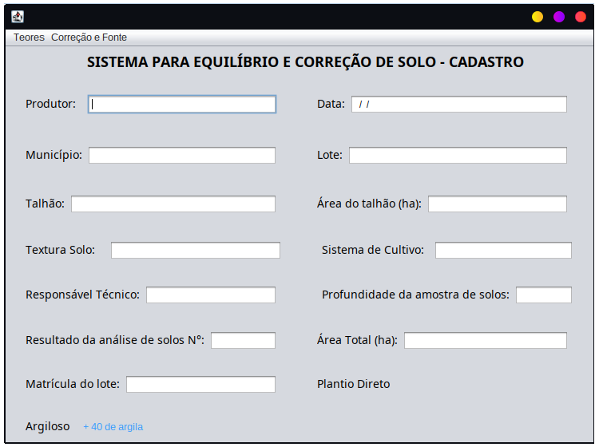
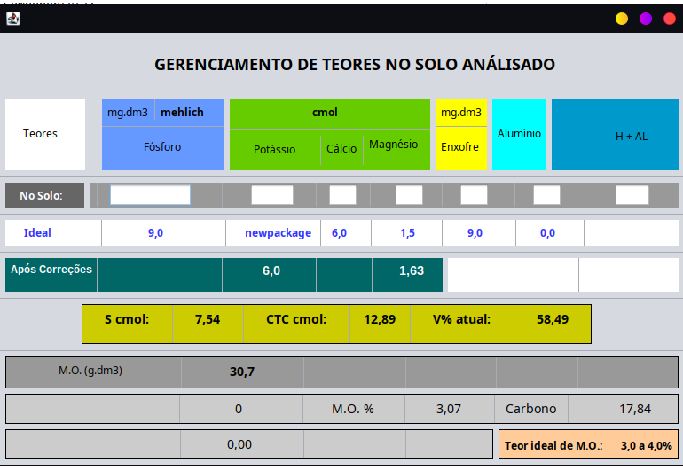
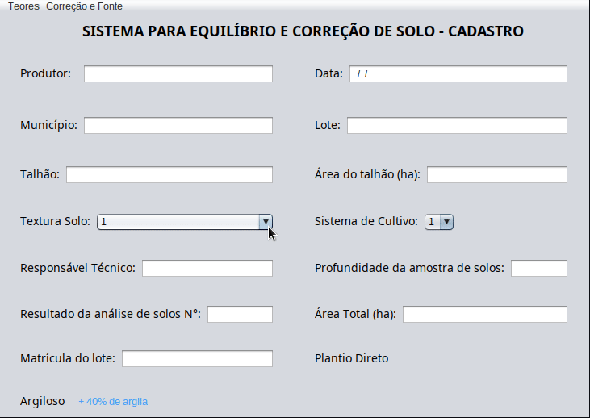
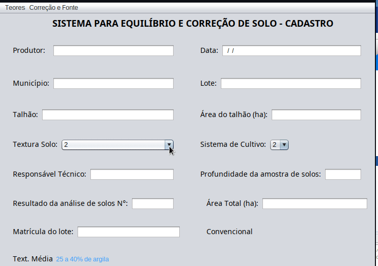
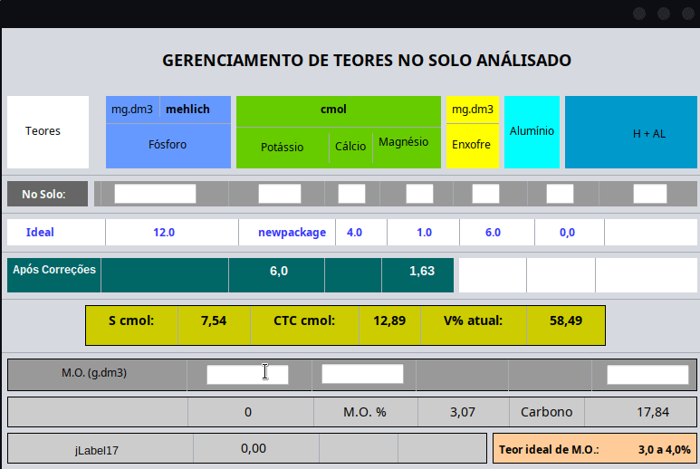
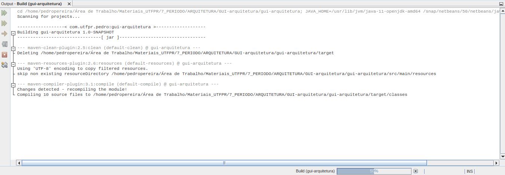

# GUI-arquitetura
<!-- vscode-markdown-toc -->

1. [Descrição](#descricao)
2. [Tecnologias](#tecnologia)
3. [Biblioteca](#biblioteca)
4. [Ferramentas](#ferramentas)
5. [Layout](#layout)
6. [Autor](#autor)

##  Descrição  :floppy_disk:

Repositório dedicado ao desenvolvimento da GUI para a atividade proposta na matéria de Arquitetura, referente a construção de uma ferramenta para o EMATER

##  Tecnologias  🚀

<<<<<<< HEAD
- [**Java-11*](https://www.java.com/pt-BR/)
=======
- [**Java**](https://www.java.com/pt-BR/)
>>>>>>> f729e9855fc1179da717f3edf31d5cc13715371c
- [**Maven**](https://maven.apache.org/) 

##  Biblioteca  📚

<<<<<<< HEAD
- [**Mockto**](https://site.mockito.org/)
- [**JUnit**](https://junit.org/junit5/)

=======
>>>>>>> f729e9855fc1179da717f3edf31d5cc13715371c
## Ferramentas  :hammer:

- [NetBeans 12](https://netbeans.apache.org/download/nb120/nb120.html)

## Layout  :scissors:

- Nesse primeiro momento foi definido um layout inicial para uma tela de cadastro no sisteam onde foram alocados campos para inserção de dados.
Além disso, há uma barra de opções que dará acesso a outras telas, cuja as quais teram suas funções
> 

- Para a tela de Teor do Solo, o primeiro layout definido visa manter o padrão de cores e organização utilizados na planilha. Nesta tela foram alocados campos do tipo text para input de informação, assim como labels para os campos onde os dados são apresentados, mas não alterados pelo usuário.
> 

<<<<<<< HEAD
- Nesse Segunda Sprint foram adicionadas algumas simulações para as comunicações que ocorrem na primeira tela do projeto e na tela para gerenciar o teor dos nutrientes no solo, onde há uma classificação inicial para o textura do solo e para o tipo de plantio como pode ser visto na figura.
> 

- Para a tela de Teor do Solo foram colocadas algumas funções para a comunição com a textura do solo selecionada e para com tipo de plantio como pode ser vista a diferença no gif a seguir.
> 

- Já para alguns campos mais especificos da tela de Teor do Solo, já foram criadas alguma simulações com calculos básico para ver o funcionamente e também com interfaces para repesentar que será abstraido de outros elementos, como pode ser visto no gif a seguir.
> 

- Por fim foram criados também testes unitário para validar a execução dessas funções de calculo criadas, e a execução dos testes pode ser vista no gif a seguir.
> 

=======
>>>>>>> f729e9855fc1179da717f3edf31d5cc13715371c
## Autor  :blue_book:

- Pedro Henrique da Silva Pereira /
- RA:2102757